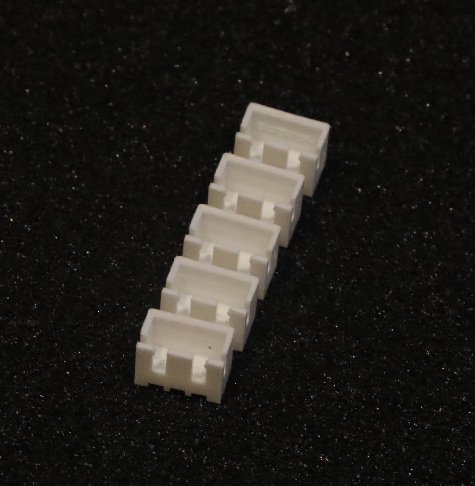

# LIPO CONNECTOR COVER v1.0 (5pack)

  

The LIPO CONNECTOR COVER is a reuasable alternative to insulation taping LiPo battery balance leads. The cover clips onto the balance connector, covering the exposed terminals and minimising the short-circuit risk when installed next to metal components. 
  
This is a [New Zealand](https://www.google.co.nz/maps/place/Christchurch+New+Zealand) based product by [cb-technology](https://www.cb-technology.co.nz/), Connor Benton.

## FEATURES
- Avalible for 2s 3s and 4s LiPo batteries.
- Integrated clips to stop the cover falling off once installed. 

## SPECIFICATIONS
- **Balance Connector Series:** JST XH
- **Weight:** <1g each